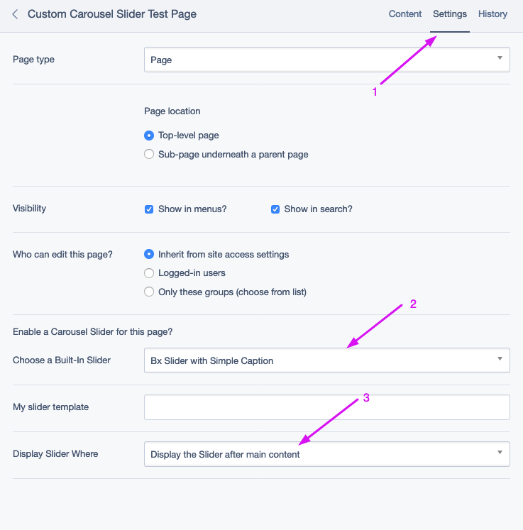
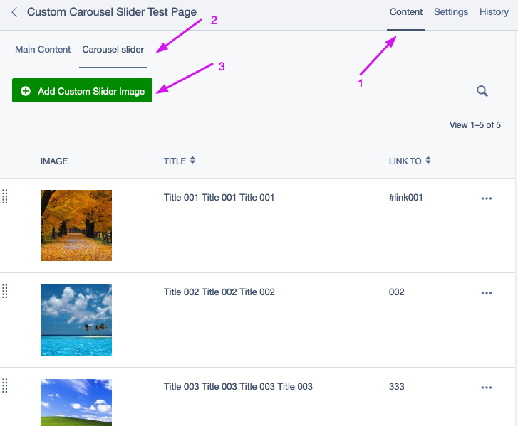
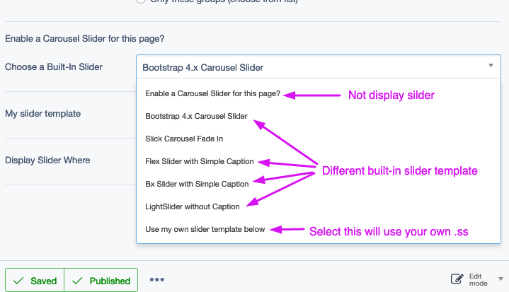
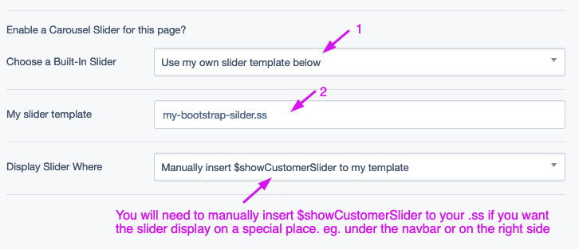

# SilverStripe Custom Carousel Slider

- Add a Custom Carousel Slider to any page for SilverStripe. Multiple built-in slider template ready to use. Very easily to custom your own slider .ss template.

# How to install

```php
composer require alexstack/silverstripe-custom-carousel-slider
```

# How to enable the Custom Carousel Slider


# How to add slider images


# How to change built-in slider template or disable slider(Not display)


# Use your own .ss template for the slider


# Example of display before content (at the top of main content)


# Example of display after content (at the bottom of main content)


# Thanks
- Inspired by I-lateral's carousel

# License
- BSD-3-Clause